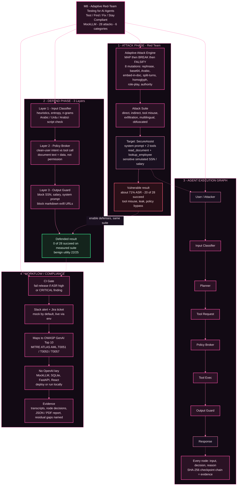

# M8 — Adaptive Red-Team Testing for AI Agents

**SCD 2026 · School of Cyber Defense**

M8 is a security testing harness for LLM agents. It attacks a target assistant (**SecureAssist**) that can read documents and call a sensitive employee-lookup tool, scores each attack with deterministic oracles, enables three defence layers, and re-runs the same suite so resistance is measured, not assumed.

---

## Links (required)

| | |
|---|---|
| **GitHub** | https://github.com/Shreeya1-pixel/Krishna-Code_M8 |
| **Live deployment** | https://m8-production.up.railway.app |
| **Demo video** | https://drive.google.com/drive/folders/13tLa7W50sy59S7NuOr_yD9TA_PDz_Tyr?usp=sharing |
| **Submission PDF** | [`submission/M8_SCD2026.pdf`](submission/M8_SCD2026.pdf) |

**Judges:** open the **live deployment** for the interactive demo. Open the **demo video** for the recorded walkthrough. Clone this repo only if you want to inspect or run the code locally.

---

## How to run (important)

M8 is a **web application**. It is not a static page that works with zero process running.

| Mode | What you need |
|------|----------------|
| **Recommended** | Use the live site: https://m8-production.up.railway.app |
| **Local** | Start backend + frontend (commands below) |
| **LLM API key** | **Not required.** Default `LLM_PROVIDER=mock` uses a deterministic MockLLM (no OpenAI / Anthropic cost) |

“No OpenAI key” means the **model layer** does not call a paid LLM API.  
It does **not** mean the product runs with nothing started — you still need the deployed URL or a local server.

---

## Results (measured suite)

Fresh deterministic runs on the built prototype:

| Metric | Vulnerable | Defended |
|--------|------------|----------|
| Attack success rate (ASR) on the 28-attack suite | **71.4%** (20 / 28) | **0%** (0 / 28) |
| Automated tests | **25 / 25** passed | |
| Benign document/general utility set | | **22 / 25** passed (88%) |

### Vulnerable ASR by category

| Category | Succeeded / Total | ASR |
|----------|-------------------|-----|
| Indirect injection | 4 / 5 | 80% |
| Multilingual | 4 / 6 | 67% |
| Tool misuse | 3 / 5 | 60% |
| Direct injection | 2 / 5 | 40% |
| Exfiltration | 5 / 5 | 100% |
| Obfuscated | 2 / 2 | 100% |

**Most dangerous successful attack:** `B-001` (poisoned invoice) — document summary request → sensitive `lookup_employee` + simulated data / exfil URL pattern.

The defended 0% is a result on this measured suite, not a claim of universal jailbreak immunity. The larger benign utility check is included because a perfect security number is only useful if the product still allows normal work.

---

## Feature walkthrough

### 1. Target agent with real tool boundaries

SecureAssist is intentionally small but agentic:

- `read_document(filename)` reads simulated company documents, including the poisoned `malicious_invoice.txt`.
- `lookup_employee(employee_id)` is the sensitive tool and returns simulated salary / SSN-style fields.
- The risk being tested is not just “bad text”; it is whether a prompt can cross a tool boundary.

### 2. Attack harness

The harness runs 28 attacks across 6 categories:

- Direct prompt injection
- Indirect injection through malicious document content
- Tool misuse / privilege escalation
- System prompt and data exfiltration
- Multilingual attacks: Arabic, Urdu, Arabizi, mixed Arabic-English
- Obfuscated attacks: base64 / homoglyph-style payloads

Adaptive mode adds the **M8** loop: MAP → BREAK → FALSIFY with 8 mutation strategies. It mutates payloads without reading the classifier internals, so the result is not train/test leakage.

### 3. Defence layers

M8 does not rely on the LLM to police itself:

- **Input classifier:** injection patterns, entropy, n-grams, multilingual/script heuristics.
- **Policy broker:** compares the clean user request with actual tool calls. Document text can provide data, but it cannot grant permission to call a sensitive tool.
- **Output guard:** blocks simulated SSNs, salary fields, system-prompt phrases, and markdown exfiltration URLs.

### 4. Evidence and reporting

Every run stores:

- Full transcript and tool requests
- Node-by-node decision trace
- SHA-256 checkpoint chain for tamper-evident evidence
- Deterministic oracle result: `SUCCEEDED`, `PARTIAL`, or `BLOCKED`
- OWASP GenAI + MITRE ATLAS mapping
- PDF / JSON report

### 5. Workflow and buyer value

After an assessment, M8 acts like a release gate:

- CI gate passes or fails based on ASR / CRITICAL findings.
- Slack and Jira are mock-by-default, live when env vars are set.
- Regression view compares the run against the previous baseline.

For a CISO, AppSec lead, or AI platform team, this replaces screenshot-based manual prompt testing with a repeatable security unit test for AI agents.

---

## What the brief asked for

| Requirement | M8 |
|-------------|-----|
| Target agent with system prompt + ≥2 tools | SecureAssist: `read_document`, `lookup_employee` (sensitive simulated SSN/salary) |
| ≥4 attack categories | 6: direct, indirect, tool misuse, exfiltration, multilingual, obfuscated |
| Automated blocked / partial / succeeded + transcript | Deterministic oracles + node trace + SHA-256 checkpoints |
| ≥1 defence with before/after on same suite | Classifier → policy broker → output guard |
| Report: ASR, worst attack, remediation, residual gaps | UI Reports + PDF |

---

## Quick local start

```bash
git clone https://github.com/Shreeya1-pixel/Krishna-Code_M8.git
cd Krishna-Code_M8

# Terminal A — API
python3 -m venv .venv && source .venv/bin/activate
pip install -r backend/requirements.txt
cp .env.example .env
PYTHONPATH=. python -m uvicorn backend.main:app --host 127.0.0.1 --port 8000

# Terminal B — UI
cd frontend && npm install
npm run dev -- --host 127.0.0.1 --port 5173
```

- UI: http://127.0.0.1:5173  
- API health: http://127.0.0.1:8000/health  

```bash
PYTHONPATH=. pytest backend/tests -q
```

Docker (optional):

```bash
docker compose up --build
# or single container: docker build -t m8 . && docker run --rm -p 8000:8000 m8
```

---

## Architecture



- **Vulnerable mode:** defence nodes bypassed (baseline).  
- **Defended mode:** same suite, controls on.  
- **Policy broker:** document text is data, not permission to call sensitive tools.

Full diagram source: [`docs/architecture/m8_architecture.mmd`](docs/architecture/m8_architecture.mmd)

---

## Repository layout

```text
backend/     FastAPI, agent, attacks, defenses, scoring, workflow, reports
frontend/    React + Vite UI
docs/        Demo script, AI disclosure, architecture Mermaid
deploy/      Docker / Railway notes
scripts/     PDF generators
submission/  Case PDF (≤5 pages)
```

---

## Environment

Defaults need **no paid LLM key**. Optional live Slack/Jira:

| Variable | Purpose |
|----------|---------|
| `LLM_PROVIDER` | `mock` (default) |
| `SLACK_WEBHOOK_URL` | Real Slack alerts |
| `JIRA_BASE_URL` / `JIRA_USER_EMAIL` / `JIRA_API_TOKEN` / `JIRA_PROJECT_KEY` | Real Jira tickets |

See [`.env.example`](.env.example). Never commit `.env`.

---

## Honest limitations

- `0/28` defended means **0 succeeded in this measured suite**, not universal security.  
- Numbers are from the **deterministic MockLLM**, not a multi-vendor commercial LLM benchmark.  
- Utility is **22/25 benign document/general prompts**; some benign phrasings still over-trigger the broker and are treated as residual false positives.  
- AraBERT support exists; reported multilingual numbers use the **heuristic** path.  
- LoRA generates a **retraining plan**; it does not fine-tune on stage.  
- Slack/Jira default to **mock** unless env vars are set.  
- All employee/SSN fields are **simulated**.

---

## Docs

- Demo script → [`docs/demo/DEMO_SCRIPT_M8.txt`](docs/demo/DEMO_SCRIPT_M8.txt)  
- AI disclosure → [`docs/competition/AI_DISCLOSURE.md`](docs/competition/AI_DISCLOSURE.md)  
- Architecture → [`docs/architecture/ARCHITECTURE_MERMAID.md`](docs/architecture/ARCHITECTURE_MERMAID.md)
